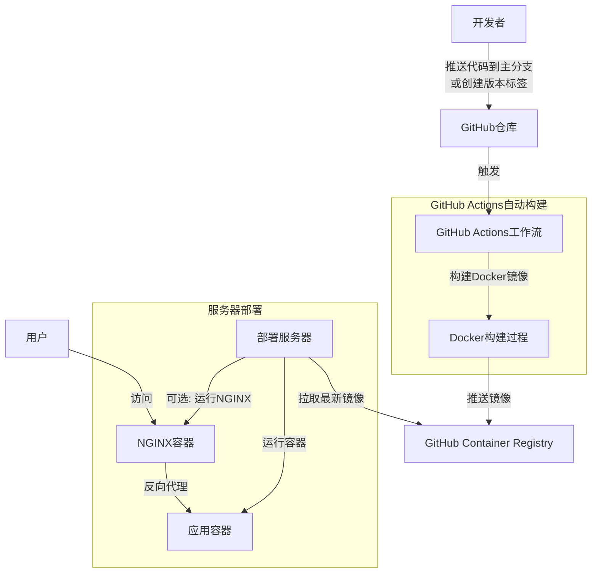

# GitHub Actions 自动构建与部署指南

本文档介绍如何使用GitHub Actions自动构建Docker镜像并部署到服务器。

## 目录

- [工作原理](#工作原理)
- [配置GitHub仓库](#配置github仓库)
- [服务器配置](#服务器配置)
- [自动部署流程](#自动部署流程)
- [常见问题](#常见问题)

## 工作原理

整个自动构建与部署流程如下：

1. 开发者将代码推送到GitHub仓库的主分支或创建新的版本标签
2. GitHub Actions自动触发构建工作流
3. 工作流构建Docker镜像并推送到GitHub Container Registry (GHCR)
4. 部署服务器从GHCR拉取最新镜像并运行



## 配置GitHub仓库

### 1. 启用GitHub Actions

确保您的GitHub仓库已启用Actions功能（通常默认启用）。

### 2. 配置仓库密钥（可选）

如果您需要在构建过程中使用敏感信息（如API密钥），请在仓库设置中添加密钥：

1. 进入仓库 → Settings → Secrets and variables → Actions
2. 点击 "New repository secret"
3. 添加所需密钥（如`API_KEY`）

### 3. 配置包访问权限

确保GitHub Container Registry可以正常使用：

1. 进入仓库 → Settings → Actions → General
2. 在 "Workflow permissions" 部分，选择 "Read and write permissions"
3. 保存更改

## 服务器配置

### 1. 安装Docker

确保服务器已安装Docker：

```bash
# 对于Ubuntu/Debian系统
sudo apt update
sudo apt install docker.io docker-compose
sudo systemctl enable docker
sudo systemctl start docker
```

### 2. 配置GitHub Container Registry访问

创建个人访问令牌（PAT）并登录到GHCR：

1. 在GitHub中创建PAT：
   - 访问 GitHub → Settings → Developer settings → Personal access tokens
   - 创建新令牌，勾选`read:packages`权限
   - 复制生成的令牌

2. 在服务器上登录GHCR：
   ```bash
   echo "YOUR_PAT" | docker login ghcr.io -u YOUR_GITHUB_USERNAME --password-stdin
   ```

### 3. 准备部署环境

1. 创建部署目录：
   ```bash
   mkdir -p /opt/snapifit
   cd /opt/snapifit
   ```

2. 创建环境变量文件：
   ```bash
   cp ENV_EXAMPLE.md .env
   # 编辑.env文件，填入必要的环境变量
   ```

3. 如果使用NGINX，创建配置文件：
   ```bash
   cp nginx.conf.example nginx.conf
   # 编辑nginx.conf，设置您的域名
   ```

4. 创建SSL证书目录（如果使用HTTPS）：
   ```bash
   mkdir -p ssl
   # 将SSL证书放入此目录
   ```

## 自动部署流程

### 方法1：使用部署脚本

1. 将部署脚本上传到服务器：
   - 对于基本部署：`deploy.sh`
   - 对于带NGINX的部署：`deploy-with-nginx.sh`

2. 赋予脚本执行权限：
   ```bash
   chmod +x deploy.sh
   # 或
   chmod +x deploy-with-nginx.sh
   ```

3. 修改脚本中的GitHub用户名：
   ```bash
   # 编辑脚本，将"你的GitHub用户名"替换为实际用户名
   ```

4. 执行脚本：
   ```bash
   ./deploy.sh
   # 或
   ./deploy-with-nginx.sh
   ```

### 方法2：设置自动部署钩子（高级）

您可以设置一个webhook服务器，当新镜像发布时自动触发部署：

1. 在服务器上安装webhook处理程序（如Adnanh's Webhook）
2. 配置webhook接收GitHub包注册表的事件
3. 设置webhook在收到事件时执行部署脚本

## 常见问题

### 1. 镜像拉取失败

可能原因：
- GitHub Container Registry登录凭证过期
- 网络连接问题
- 仓库权限配置错误

解决方案：
- 重新登录GHCR：`docker login ghcr.io`
- 检查网络连接
- 检查仓库权限设置

### 2. 容器启动失败

可能原因：
- 环境变量配置错误
- 端口冲突
- 容器内部错误

解决方案：
- 检查`.env`文件配置
- 检查端口占用情况：`netstat -tulpn | grep 3000`
- 查看容器日志：`docker logs snapifit-app`

### 3. NGINX配置问题

可能原因：
- 配置文件语法错误
- SSL证书路径错误
- 反向代理设置不正确

解决方案：
- 验证NGINX配置：`docker exec snapifit-nginx nginx -t`
- 检查SSL证书路径和权限
- 检查NGINX日志：`docker logs snapifit-nginx`

---

如有任何问题或需要进一步的帮助，请联系项目维护者或提交Issue。 